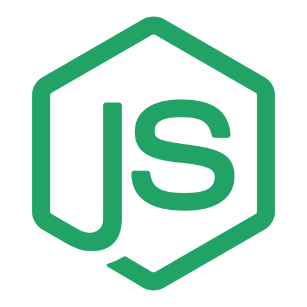
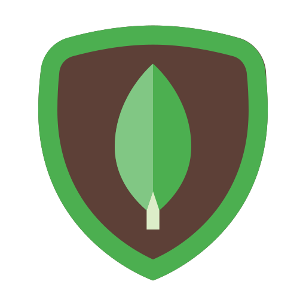

<h1>
Hi, I am Asad Ali Asim

</h1>
<b>  
I am a Full-stack developer with a strong focus on backend development. Expertise in crafting robust server-side solutions and scalable architectures. Passionate about building efficient and high-performance systems. Continuous learner exploring new technologies to enhance the full development stack.

</b>

<h2>🛠 <b>Languages and Tools</b></h2>

  
  
  
  
  
  
  
  
 
  
  

 

<h2>🚀 <b>GitHub Statistics</b></h2>

  
  

    
  

  

    
  

 

 
