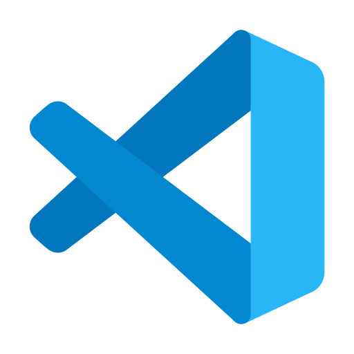

<h1>
Hi, I am Asad Ali Asim

</h1>
<b>  
I am a Full-Stack Developer with more than three years of experience. I am capable of building scalable and productive next-generation
solutions. I have the best experience in developing and scaling web-based applications and products in both the development and production
phases.
</b>

<h2>🛠 <b>Languages and Tools</b></h2>

  
  
  
  
  
  
  
  
 
  
  

 

<h2>🚀 <b>GitHub Statistics</b></h2>

  
  

    
  

 

 
